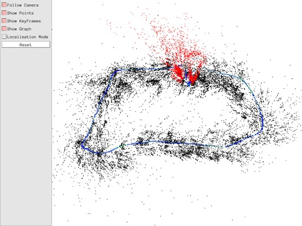

# orbslam2_cg

modified version from [raulmur/ORB_SLAM2](https://github.com/raulmur/ORB_SLAM2) (commit f2e6f51  on Oct 11, 2017)  

[ORB-SLAM](http://webdiis.unizar.es/~raulmur/orbslam/) is a versatile and accurate SLAM solution for Monocular, Stereo and RGB-D cameras.

* [ethz-asl/orb_slam_2_ros](https://github.com/ethz-asl/orb_slam_2_ros)
* [ORB-Slam2: Implementation on my Ubuntu 16.04 with ROS Kinect](https://medium.com/@j.zijlmans/orb-slam-2052515bd84c)

-----

[TOC]

# Dependencies

* OpenCV 3
* Eigen3
* Pangolin
  ```bash
  git clone https://github.com/stevenlovegrove/Pangolin.git
  cd Pangolin & mkdir build & cd build
  cmake .. & cmake --build .
  ```
* DBoW2 and G2O
  - Dowload from [ORB_SLAM2/Thirdparty/](https://github.com/raulmur/ORB_SLAM2/tree/master/Thirdparty) and move them to `orbslam2_cg/Thirdparty`
    ```
    cd orbslam2_cg
    svn checkout https://github.com/raulmur/ORB_SLAM2/trunk/Thirdparty
    ```
* ROS (optional)

# Build

```bash
cd orbslam2_cg/scripts

# main project
./build.sh

# for ROS, need to execute build.sh first
./buid_ros.sh
```

# Run

## without ROS
```bash
cd orbslam2_cg/scripts
./run_<mono_tum>.sh  # modify it before run
```

## with ROS

```sh
cd orbslam2_cg/Examples/ROS/ORB_SLAM2/
source build/devel/setup.bash

roslaunch ORB_SLAM2 run_<mono>.launch
```

* with MYNTEYE-S1030
  ```sh
  roslaunch ORB_SLAM2 run_stereo_mynteye_s1030.launch
  ```
  <div align=center>
    
  </div>
